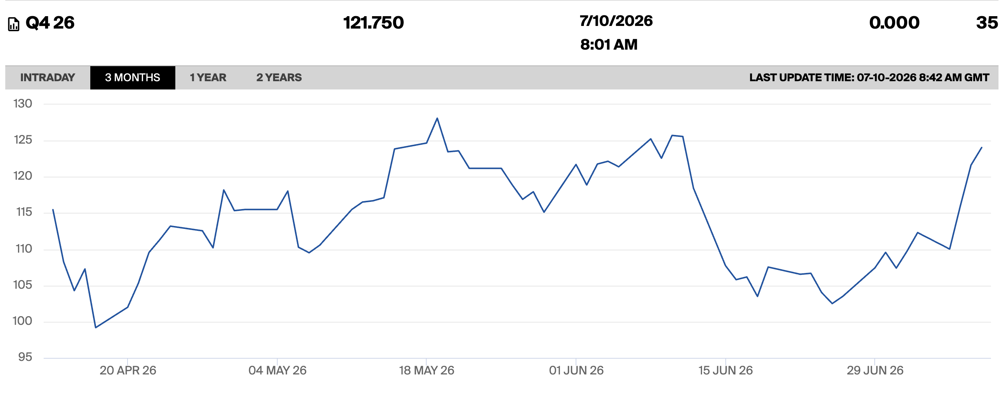
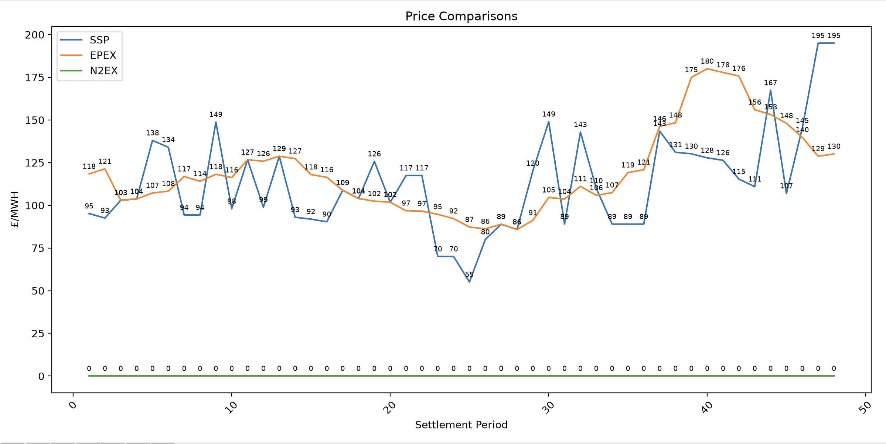

# Market Log — 9 July 2026

## Observations and Drivers

**Primary observation:**

> The main occurance this week has been the steady rise in natural gas futures, again, back to prices of pre-Memorandum of Understanding, based on the breakdown of that agreement that has taken place this week. 

Credit: [ICE, UK NBP Natural Gas Futures, Q4 26, 3 Months](https://www.ice.com/products/910/UK-NBP-Natural-Gas-Futures/data?marketId=7426934&span=1)

> Beyond missle strikes from both sides against targets on sea and on land impacting prices, volume being sent through the strait has driven to a halt, especially across the Omani route. Looking into Iran's requirement of travel through a given route, Iran has laid (80+) mines within the traditional shipping route ([Hormuz Tracker](https://hormuzstraitmonitor.com/blog/mines-no-map/)), and thus freighters must either travel north or south of their traditional route while Iran attempts to clear those mines. Additionally, [Council on Foreign Relations](https://www.cfr.org/articles/strait-of-hormuz-traffic-faced-a-long-road-to-recovery-now-the-iran-deal-is-unraveling) provided confirmation of this, plus insighted that by travelling closer to Oman and Iran, these countries will be able to impose more influence over the trade. This may notibly include the toll that Iran is seeking to impose (one of the temporary conditions in the MoU to not impose), and travel through Omani territorial waters prevents this if it becomes the norm.   

Credit: [BBC, Thomas Copeland and Libby Rogers](https://www.bbc.co.uk/news/live/c17y1vnn2qxt)

> Kpler's [Markets in Motion | 9 July 2026](https://www.youtube.com/watch?v=za1Au7PGjSA) session points out that transit outbound was not significantly impacted by the MoU breakdown (likely attempting to not get trapped upon further escalation), but inbound has halved. Freight rates fell last week but are on the rise again. TTF Netherlands and JKM Asia are bullish, expecting prices to rise, due to El Nino hot weather + low gas storage + geopolitical risk. 
> 
> A Kpler article (https://www.kpler.com/blog/eroding-confidence-in-the-strait) also points out that the MoU was great in opening the Strait again to enable stuck ships to escape, but did little to increase confidence in empty (ballast) carriers returning. This week's conflict doubles down on that, so that even if there is another ceasefire in the future there is even less reason to think that won't be temporary again and will keep risk premiums and freight fees high.

**Secondary observation:**

> System prices and EPEX performed reasonably strongly on the 9th, especially given the Margin Notice issued for the peak period. On the 8th there was a notice that between 6:30pm and 10:30pm there was a shortfall of 1200 MW against the System Margin, which was then amended and then cancelled at 6:30pm. Prices at 6:30 did rise £50 from the previous half hour to £143, not unusual for the last few days, but steadily fell to £111, which is not typically this smooth but generally prices do fall over this period, just with much higher spikes due to short-term shortages, which likely were not present with a conscious effort being made to increase the system margin at this time. Interestingly, though, prices did rocket up to nearly £200, the highest they've been in a given period for a week, at the end of the day, right after the margin report period. 

Data from Elexon BMRS API and graphed myself.

--

## Sources

https://www.bbc.co.uk/news/live/c17y1vnn2qxt

https://www.ice.com/products/910/UK-NBP-Natural-Gas-Futures/data?marketId=6164522

---

*Entry by Lachlan Jack | [linkedin.com/in/Lachlan-Jack/](https://www.linkedin.com/in/Lachlan-Jack/)*