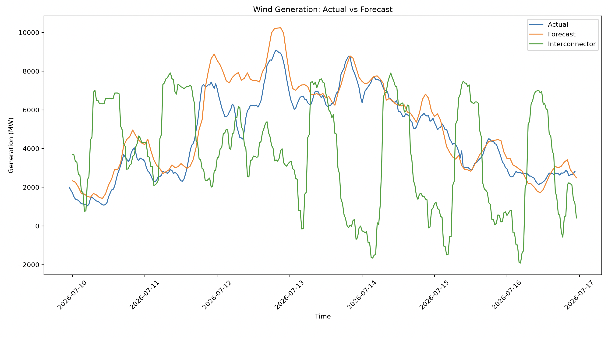
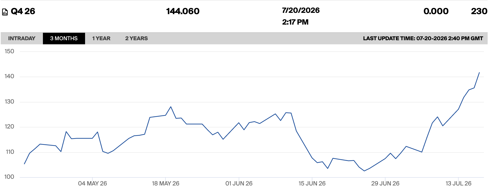

# Market Log — 10th to 16th July 2026

## Power

### Day Ahead N2EX and EPEX

- The previous week has remained a constant, stable 'summer' shape N2EX profile, with weekdays not falling below a predicted £70, and weekends behaving as usual with lower Saturday mid-days due to lower aggregate demand.  

### Renewables Forecast

- Mostly low wind forecast, apart from the weekend 11th/12th, aligning with the idea that there will be low-priced middays during this time. The national forecast has done a great job at forecasting the generation for the date, only under-forecasting for brief periods during times of high (predicted) outturn. 

### System Price

- Outturn system buy/sell price only fell below £0 during the peak midday Saturday, as expected by N2EX and EPEX, with only a few brief half hours of £160+/MWh. Of the 4 periods of increased price, 3 of were weekday super-peak times (7pm), however also July 13th 7am. Net imbalance volume did not shift dramatically at this time day.  

### Balancing and Interconnectors

- NA

## Gas

### Geopolitical and Supply

- Last week's geopolitical tensions continued to rise within the Persian gulf, with repeated and continuous strikes in the region grinding freight to a halt, announcement of an apparent closure of the strait and an additional blockade re-implemented. 

- Via the IMF's Portwatch (which is unfortunately updated with a 7 day lag), the breakdown of the MoU on the 8th of July had a significant impact on the little traffic through the strait, with a 7-day average of 34 (compared to last year at ~100 arrivals of ships) has fallen to 10 arrivals on the 12th of July. Reports by BBC shows that transits has levelised at 10 per day, with the addition of the Iran blockade and US attacks on ships traversing towards Iranian ports. 

## Cross Commodity Futures

### NBP Gas Futures and Spark Spread

- ICE's published Q4 2026 NBP Gas futures has shown a steady increase in price since the 8th, with prices continuing a steady rise each day with more information of breakdown of a conclusion to the crisis. 

### Power Futures

- Markets have shown that carbon prices have remained relatively unimpacted in the last month to any geopolitical conflicts, with the price of UK ETS (£/tonne) at £57, high compared to the mid-£30s during March but lower than January's £70. Prices remain at a similar level to last year's July price of £50. Ultimately, then, I would expect increased Summer 26-Winter 26 contango within the power futures market, with gas being a lower marginal generator within the solar-plentiful summer prices and inflating winter prices up whilst there is expectation that the NBP will remain high into the winter from the marginal LNG imports and competition with Asia's JKM.

## Sources

https://portwatch.imf.org/pages/cc317ba850e34c4dadbead6f7b336fb1

https://www.theguardian.com/world/2026/jul/12/us-and-iran-exchange-strikes-as-tehran-again-says-strait-of-hormuz-is-closed

https://www.bbc.co.uk/news/articles/clyqwkegqk0o

https://www.purelyenergy.co.uk/tools/carbon/uk-ets

---

*Entry by Lachlan Jack | [linkedin.com/in/Lachlan-Jack/](https://www.linkedin.com/in/Lachlan-Jack/)*